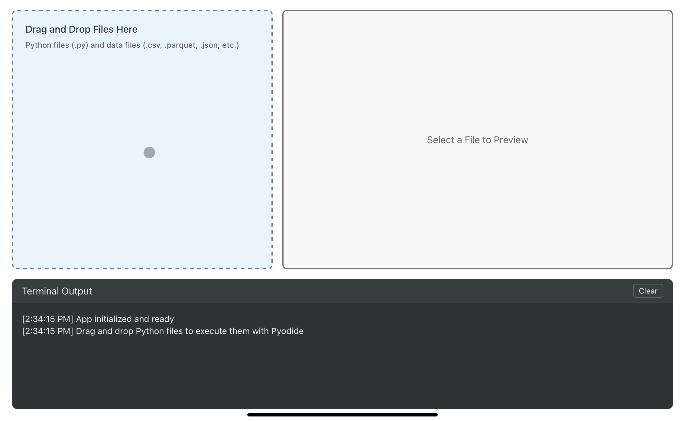

# BrowserBox

Simple browser based sandbox for executing Python files. Just download the html file and open it with any modern browser. (Simple as that).



## Workflow

Simply drag and drop python scripts and any associated files to add them to the environment. Once you click run, the sandbox will spin up a webrunner with pyodide, automatically load the script's imports, and the file. The terminal will display printed output and any generated files will be copied back into the dropzone for you to preview or download.

## Things to Note

Note that a limited number of file types can currently be previewed, but includes html, parquet, csv, and json. Also be aware that if you want to plot with a package like matplotlib, you will need to set the backend to a non-interactive environment, like so:

```{python}
import matplotlib
matplotlib.use("Agg")
import matplotlib.pyplot as plt
```

The list of packages that are natively supported by pyodide and can be auto-imported has been steadily growing. Check out the latest list here: https://pyodide.org/en/stable/usage/packages-in-pyodide.html#packages-in-pyodide


